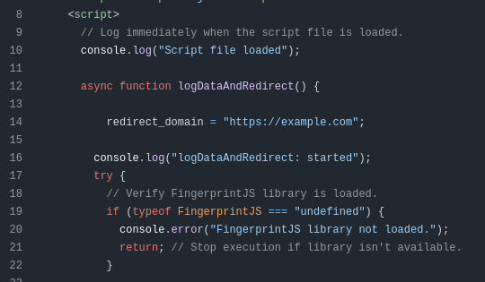

# VisitorsID

## Track Who Visits Your Website

VisitorsID is a simple tool that helps you track visitors to your website by collecting their digital fingerprints and other information before redirecting them to your main website.

## How It Works

1. You set up VisitorsID on a domain (like tracking.yourdomain.com)
2. When someone visits this domain, the tool collects information about their browser and device
3. This information is saved to a log file on your server
4. The visitor is automatically redirected to your main website (like yourmainsite.com)
5. You can later view the logs to see who visited your site

## Installation Guide

### Step 1: Download the Files

Download all the files from this repository by clicking the green "Code" button and selecting "Download ZIP". Extract the ZIP file to your computer.

### Step 2: Edit the Redirect Domain

Open the `index.html` file in any text editor (like Notepad, TextEdit, or VS Code).

Find this line (around line 10):
```javascript
redirect_domain = "https://example.com";
```

Replace `https://example.com` with the URL of your main website where visitors should be redirected. For example:
```javascript
redirect_domain = "https://yourmainwebsite.com";
```

Save the file after making this change.



### Step 3: Upload to Your Web Hosting

1. Log in to your web hosting control panel (usually cPanel, Plesk, or similar)
2. Navigate to the File Manager
3. Go to the directory where you want to install VisitorsID (usually public_html or www)
4. Upload all the files from the extracted ZIP folder


### Step 4: Set Permissions (Optional)

If the tool doesn't work, you might need to set proper permissions:
1. In your hosting File Manager, right-click on `logs.txt` and select "Change Permissions"
2. Set the permissions to 666 or check "Write" for all user types
3. Click "Save"

## Viewing Visitor Data

To see who has visited your site:

1. Log in to your web hosting control panel
2. Navigate to the File Manager
3. Find and open the `logs.txt` file
4. Each line in this file represents one visitor


## Understanding the Log Data

Each entry in the log file contains information about a visitor in JSON format. Here's an example:

```
{
  "fingerprint": "a1b2c3d4e5f6g7h8i9j0",
  "userAgent": "Mozilla/5.0 (Windows NT 10.0; Win64; x64) AppleWebKit/537.36 (KHTML, like Gecko) Chrome/91.0.4472.124 Safari/537.36",
  "platform": "Win32",
  "referrer": "https://www.google.com/",
  "timestamp": "2025-05-04T12:34:56.789Z",
  "ip": "192.168.1.1"
}
```

This information includes:

- **fingerprint**: A unique identifier for the visitor's browser/device
- **userAgent**: Information about the visitor's browser and operating system
- **platform**: The visitor's computer platform (Windows, Mac, etc.)
- **referrer**: Where the visitor came from (like Google or another website)
- **timestamp**: When the visit occurred
- **ip**: The visitor's IP address

## Troubleshooting

If you're having issues:

1. Make sure all files were uploaded correctly
2. Check that `logs.txt` is writable (has proper permissions)
3. Verify that your web hosting supports PHP

## Privacy and Legal Considerations

When using this tool, remember to:

1. Update your privacy policy to disclose that you collect this information
2. Comply with privacy laws like GDPR if you have European visitors
3. Use the collected data responsibly and securely

---

For questions or support, please open an issue on this GitHub repository.
